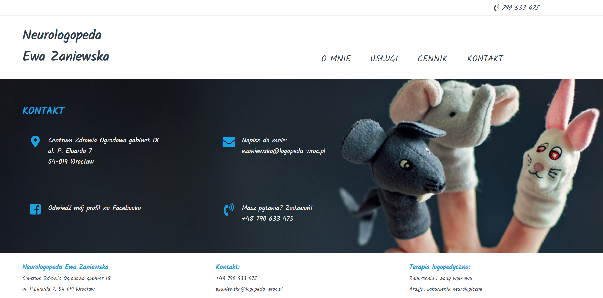

# Logopeda Wroclaw
> Webpage created with HTML, CSS, JavaScript.

##Table of Contents

* [General info](#general-info)
* [Screenshots](#screenshots)
* [Technologies](#technologies)
* [Setup](#setup)
* [Status](#status)
* [Contact](#contact)

##General info
This project is a simple webpage created for a logopedist from Wroclaw. 

##Screenshots

##Technologies
* HTML5
* CSS3
* Javascript ES6
* files.svg were created in Adobe XD,
* Visual Studio Code.

##Setup
To run my project open index.html in webbrowser.

##Status
Project is: _in progress_

##Contact
Created by [@CarolKuch](https://github.com/CarolKuch)